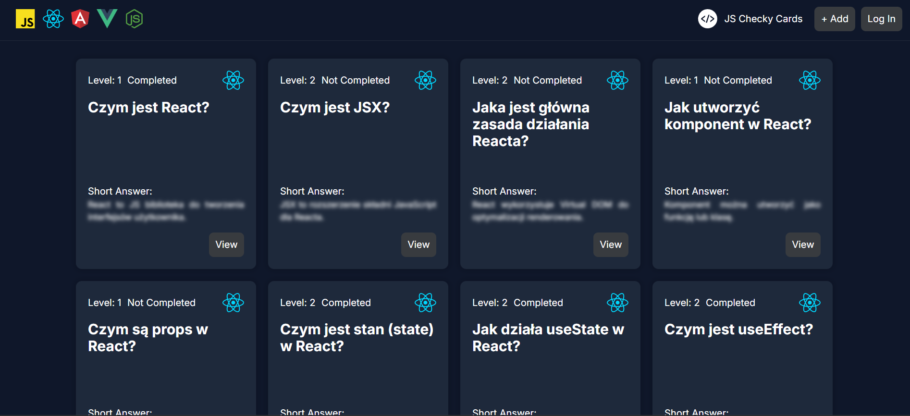

# JS Checky Cards

**JS Checky Cards** is a Single Page Application built with **React + Vite**.

The main purpose of this project for me is to deeply understand and practice core React concepts by building a real-world, feature-rich learning application.

It allows users to create, manage, and review knowledge cards related to programming concepts — primarily React, as part of my learning journey — but also other JavaScript-based technologies.



## 📚 Project Purpose

This application is built as part of my learning React.

The primary goals are:

- Practice core React concepts in a real-world scenario
- Build a scalable SPA architecture
- Manage state effectively
- Implement authentication and protected routes
- Work with forms, pagination, and filtering
- Apply best practices in component design

Although most default content focuses on React concepts, users can freely create and manage their own cards.

## 🧠 Main Idea

JS Checky Cards is a card-style future developer knowledge manager.

Each card contains:

- **Title**
- **Category (Vanilla JS, React, Node.js etc.)**
- **Short Description**
- **Extended Description**
- **Example Usage**
- **Knowledge Status** (Completed / Not completed)

Users can:

- ➕ Create cards  
- ✏️ Edit cards  
- ❌ Delete cards  
- 🔁 Mark as completed / not completed
- 🔎 Filter by category
- 📄 Navigate through paginated results  
- 🌗 Use automatic Dark / Light mode

## ⚙️ How to run
1. Install dependencies
```bash
npm install
```
2. Start JSON Server (mock backend)
```bash
npm run server
```
3. Start the frontend (in a separate terminal! ⚠️)
```bash
npm run dev
```

## 📦 Backend (JSON Server)

The project uses JSON Server as a mock REST API.

- Contains 60 React-related questions
- Data is loaded dynamically after server startup
- Simulates real backend behavior


## ⚙️ Supported Technologies (Categories)

Currently supported categories:

- JavaScript
- React
- Angular
- Vue
- Node.js

The application is React-focused, but users can create cards for any supported category.

## 🔐 Core Features

### Card Management (CRUD)

- Create new cards
- Edit existing cards
- Delete cards
- Toggle knowledge status

### Pagination

- Paginated card list
- Dynamic page navigation
- Efficient rendering

### Filtering

- Filter by selected technology
- Display only relevant concepts

### 🌗 Dark / Light Mode

- Automatic theme detection (based on system preferences)
- Optional manual theme switch (Light / Dark)
- Persistent theme selection

## ⚛ React Concepts Practiced

This project is designed to cover and reinforce:

- Functional Components
- Props
- useState
- useEffect
- Conditional Rendering
- Controlled Forms
- Lifting State Up
- Component Composition
- Custom Hooks
- Context API
- React Router
- Protected Routes
- Pagination Logic
- Form Validation
- Performance Optimization (memo, useCallback, useMemo)

## 🏗 Architecture Overview

- Single Page Application (SPA)
- Modular component structure
- Reusable UI components (Button, Card, Modal, etc.)
- Clear separation of concerns
- Organized folder structure


## 🎯 Learning Goals

JS Checky Cards is about:

- Understanding how React works internally
- Building scalable frontend architecture
- Practicing state management patterns
- Gaining confidence with real-world SPA development
- Writing clean and maintainable code


